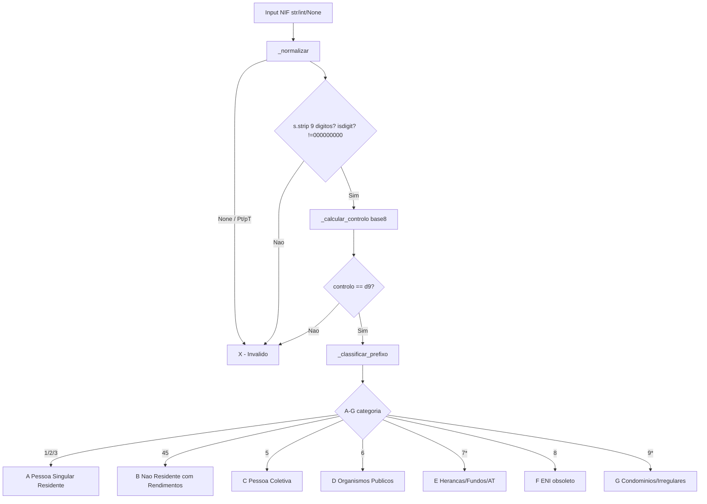

# Arquitetura

## Visão Geral

```
src/valida_nif.py      -> valida_nif, completa_nif, classifica_nif
src/tabela_nif.csv     -> mapeamento indice->categoria
docs/                  -> documentação técnica e utilizador
```

## Fluxo de Validação e Classificação



## Módulos

| Módulo | Responsabilidade |
|---|---|
| `_normalizar` | trim, PT/pt, None para prefixo invalido |
| `_calcular_controlo` | soma ponderada 9..2 mod11 |
| `valida_nif` | bool 9 digitos + controlo |
| `completa_nif` | 8->9 digitos |
| `classifica_nif` | reutiliza valida_nif, devolve A-G/X |
| `_classificar_prefixo` | prioridade 45/70/71... antes de 1-char |
| `TABELA_NIF` | dict em memoria, fallback CSV |

## Decisões

- `classifica_nif` retorna `X` em vez de levantar, para uso batch CLI.
- `45` verificado antes de `4` (4 isolado = X).
- `8` mapeado para `F` com estado obsoleto, não erro.
- CSV carregavel mas não obrigatório; dict hardcoded garante offline.
