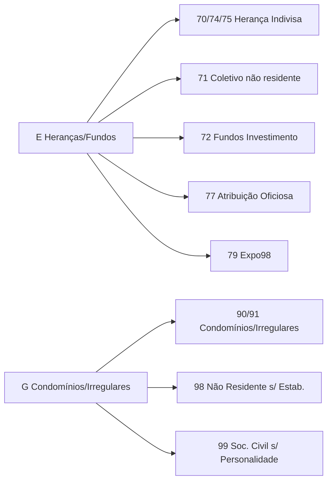

# Tabela de Correspondência NIF

Fonte: `src/valida_nif_py/tabela_nif.csv` — 1-char `indice` → `categoria`

## Índices A-G + X

| Índice | Categoria | Prefixos | Descrição | Base Legal | Estado |
|---|---|---|---|---|---|
| A | Pessoa Singular - Residente | 1, 2, 3 | Cidadãos nacionais e estrangeiros residentes | DL 14/2013 Art4 + Nota AT 2019-07-04 | ativo |
| B | Pessoa Singular - Não Residente com Rendimentos | 45 | Não residentes apenas com rendimentos com retenção definitiva | DL 14/2013 Art4 n3 | ativo |
| C | Pessoa Coletiva - Residente | 5 | Sociedades comerciais e empresas privadas residentes | RNPC DL129/98 Art13 | ativo |
| D | Organismos Públicos | 6 | Estado, câmaras, escolas, administração pública | RNPC DL129/98 Art13 | ativo |
| E | Heranças, Fundos e Entidades Especiais (AT) | 70,71,72,74,75,77,79,7 | Heranças indivisas, fundos investimento, atribuição oficiosa, regime Expo98 | DL14/2013 Art11 n3 Art16 n2 | ativo |
| F | Empresário em Nome Individual (ENI) | 8 | ENI histórico, hoje migrado para 1-3 | RNPC DL129/98 Art13 | obsoleto |
| G | Condomínios, Sociedades Irregulares e Não Residentes Coletivos | 90,91,98,99,9 | Condomínios, sociedades irregulares/civis, não residentes s/ estabelecimento | RNPC DL129/98 Art13 | ativo |
| X | Inválido ou Desconhecido | 0, 4 | Prefixo não atribuído, formato inválido ou dígito controlo errado | N/A | erro |

## Sub-gamas E e G (detalhe)



## Prioridade de Matching

`45` > `70/71/72/74/75/77/79/90/91/98/99` > `1-char`. Ex: `45xxxxxxx` → B, não X por `4`.

## CSV

```csv
indice,categoria,prefixos,descricao,base_legal,estado
A,Pessoa Singular - Residente,"1;2;3",...
```

Carregado via `_carregar_tabela_csv()` com fallback para dict hardcoded.
